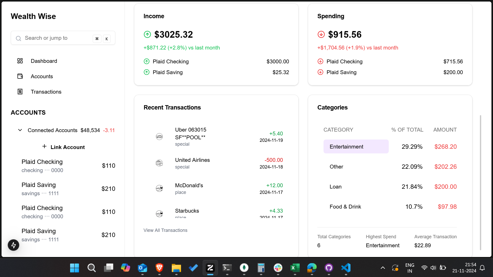
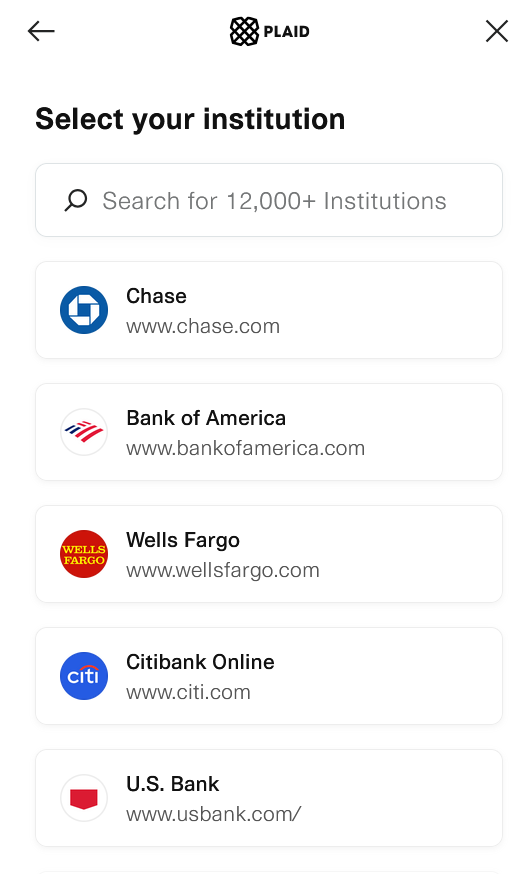
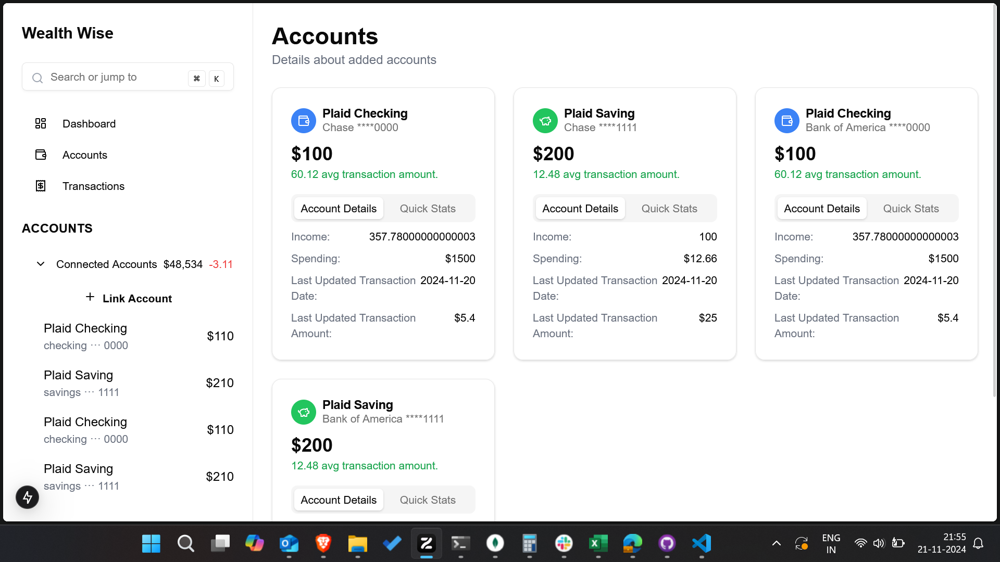
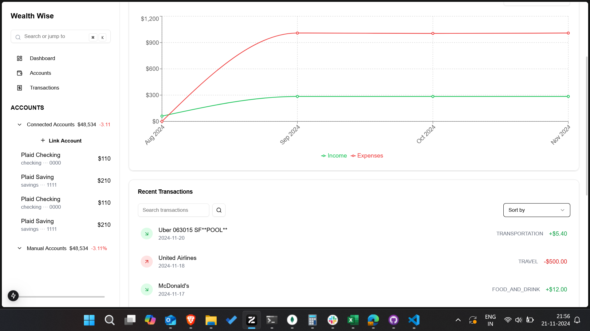

# WealthWise - Personal Finance Dashboard

WealthWise is a comprehensive personal finance management application designed to help users track their financial health. With WealthWise, users can securely connect their bank accounts, monitor their net worth, manage transactions, and gain insights into their spending habits.



### Key Workflows

1. **Plaid Link Integration**  
   Connect your bank accounts securely using Plaid Link.



**Plaid Link Flow:**

- Click "Link Account" button
- Select your bank
- Enter credentials
- Authorize access

3. **Account Management**  
   Manage all your connected accounts in one place.



**Accounts View:**

- Connected bank accounts
- Manual accounts
- Account balances
- Transaction history

4. **Transaction Management**  
   Detailed transaction tracking and categorization.



**Transactions:**

- Filter transactions
- Search for transactions
- Transaction details

## Configuration

### Plaid API Setup

1. Create a [Plaid account](https://dashboard.plaid.com/signup)
2. Get your API credentials from Plaid Dashboard
3. Create `.env` file in both frontend and backend directories:

```env
# Backend .env
PLAID_CLIENT_ID=your_client_id
PLAID_SECRET=your_secret_key
PLAID_ENV=sandbox

# Frontend .env
NEXT_PUBLIC_API_URL=http://localhost:8000
```

### Frontend Setup

```sh
cd v0_frontend
npm install
npm run dev
```

### Backend Setup (in new terminal)

```sh
cd backend/node
npm install
npm run start
```
